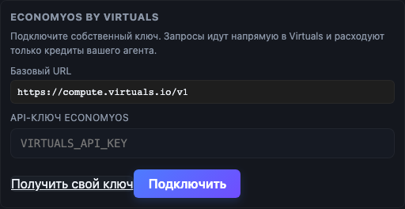

# EconomyOS integration

AI Free supports EconomyOS Agent Compute by Virtuals as an optional bring-your-own-key provider in both the desktop app and the VS Code extension.



## Native agent loop

EconomyOS code-agent requests use the OpenAI-compatible native tools protocol. AI Free sends function definitions through `tools`, receives structured `tool_calls`, executes approved tools locally, and returns each result as a `role: "tool"` message with the matching `tool_call_id`. `parallel_tool_calls` is disabled so local actions are executed and acknowledged in a deterministic order.

Native tool turns use non-streaming JSON responses to avoid SSE transport interruptions during long agent runs. When a new code-agent session starts, AI Free combines a size-bounded live chat tail with a separate compressed block of task-relevant long-term memory. There is no fixed message-count cutoff. Older large tool results are compacted while recent results remain available to the model.

AI Free paces native tool requests to avoid exhausting Virtuals request limits. HTTP 429 and temporary transport failures use bounded backoff instead of an infinite retry loop. Before every model turn, the agent persists its API session history, pending `tool_result`, and local tool log as a chat checkpoint. Sending `продолжай` or `resume` restores that checkpoint, including after an AI Free restart, without executing already completed local tools again.

The browser-style text/JSON tool emulation remains only for providers that do not expose a native API tool protocol. EconomyOS does not use that compatibility path.

## Official API contract

- Base URL: `https://compute.virtuals.io/v1`
- Endpoint: `POST /chat/completions`
- Authentication: `Authorization: Bearer <VIRTUALS_API_KEY>`
- Protocol: OpenAI-compatible Chat Completions; streaming for chat and JSON responses for native tool turns
- Model catalog: `GET /models`, loaded with the user's credentials
- Fallback model: `z-ai-glm-4-7-flash`; the older `moonshotai/kimi-k2-0905` quickstart example currently has no available provider

References:

- [EconomyOS Agent Compute](https://os.virtuals.io/agent-identity/compute/overview)
- [Virtuals agents and Compute settings](https://app.virtuals.io/acp/agents)
- [EconomyOS developer credits](https://os.virtuals.io/community#credits)

## User-owned credits

AI Free does not include, proxy, share, or remotely retrieve a project-wide EconomyOS key. Each user creates or selects their own Virtuals agent, claims their own credits, and enters their own API key in **Settings → API → EconomyOS by Virtuals**.

Requests travel directly from the user's local AI Free process to `compute.virtuals.io`. There is no AI Free relay server in the request path. Usage is therefore charged only to the Virtuals agent associated with the user's key.

## Secret handling

- The key is stored only in the local AI Free settings file, which is written with owner-only permissions (`0600`) where supported.
- `VIRTUALS_API_KEY` can be used instead of storing a key in the settings file.
- Settings responses expose only `configured`, `source`, and the official base URL. They never return the key.
- The key is sent only in the HTTPS Authorization header and is never included in request bodies, chat history, logs, exported conversations, or repository files.
- The base URL is fixed to the official EconomyOS Compute endpoint to prevent credential redirection.

## Supported AI Free workflows

- regular streamed chat;
- workspace-aware code agent;
- agent pipelines;
- desktop app and VS Code extension;
- local conversation history and memory.

Web search remains an AI Free browser tool rather than an EconomyOS-native model feature.

## Verification

Run:

```bash
node --test test/economyos-client.test.mjs
```

The tests verify the official endpoint, Bearer authentication, OpenAI-compatible SSE chat streaming, native tool calls, conversation context, tool-history compaction, and absence of the key from request bodies.
